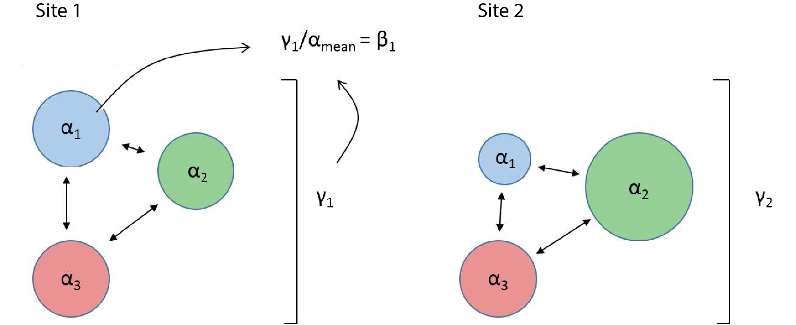

# Background information

Quantifying biodiversity is an active area of research for ecologists and conservationists. Organisms have evolved alongside each other, and developed adaptations that allow them to thrive in different niches. The interactions between these organisms, and between these organisms and their environment can be incredibly complex. How diverse communities are, and how diversity changes area to area, can tell us a lot about an ecosystem. How do we even measure diversity? Or how similar 2 areas are? Alpha-diversity is a measure of biodiversity at a single location, while gamma-diversity is the cumulative diversity in a particular region of interest. Beta-diversity links the two, and is a measure of variable community composition is among locations (Fig. 1). 

```{r partition-fig, echo = FALSE, fig.cap="Schematic representation of how alpha (sample level), gamma (region level), and beta (sample variability) diversities are related. For each stream you have multiple measures of alpha-diversity (taxa richness), with one measure of gamma and beta-diversity per stream.", fig.show='hold', out.width="100%", fig.align="center"}

```

There are many ways to quantify biodiversity, and scientists have been discussing (i.e. arguing) about the best way to go about it for years, but at its heart all biodiversity metrics are a way to compress complex information into an interpretable number. A coarse analogy would be the Body Mass Index (BMI) score. Humans are comprised of assemblages of cells and organ systems, and we could measure the health of a single individual in thousands of different ways. The BMI score is a simple way to compress that information into a single number that we can use to assess relative 'health'. We can do something similar for biodiversity! I do not want you to conflate 'health' with 'biodiversity', but it is a useful starting point. For this lab we will use species richness (the number of species) as our measure of biodiversity.

Benthic macroinvertebrates (Fig. 2) are a useful group of study organisms because they are incredibly diverse, and are important ecological indicators of the physical and chemical characteristics of streams. Some are sensitive to changes in dissolved oxygen or pH, or will struggle if sediment loads into the stream from the surrounding landscape are too high. Stream ecosystems are linked to the areas around them (their watershed). Think of some ways that humans influence the landscape - then Google how those changes influence aquatic environments (most anthropogenic impacts are very well studied). 

```{r invert-fig, echo = FALSE, fig.cap="Example macroinvertebrate (Order: Trichoptera) that you will collect in the field and identify under a dissecting microscope. Caddisflies frequently have elaborate shells built from materials around them in the stream.",fig.show='hold', out.width="50%", fig.align="center"}
knitr::include_graphics("../_chapter_materials/invert_pic.jpg")
```


# Objectives

We collected macroinvertebrates from 2 sites in central Texas that differed in anthropogenic impact using 1 m^2^ kick-screens. The Middle Bosque, while it does have some farm and pastureland in its watershed, it relatively undisturbed compared some other streams in the area. Hog Creek is in an adjacent watershed, and has slightly higher nutrient concentrations that cause large blooms of nuisance filamentous algae. You will use this data to compare biodiversity between the two sites and answer the following questions:

1. Does anthropogenic impact influence mean alpha diversity?
    * Assess this question by calculating alpha-diversity. Display this information in a column graph, and use a t-test to determine if there are statistically signifiant differences between alpha-diversity of the two streams.

2. Does anthropogenic impact influence gamma diversity?
    * Calculate gamma diversity for each stream and report these values in the text.
  
3. Does anthropogenic impact influence beta diversity?
    * Calculate beta diversity for each stream and report these values in the text.
    

# Lab report specifics

1. Introduction
    * Why is biodiversity important?
    * How is biodiversity measured?
    * Why are macroinvertebrates useful?
    * Objectives
    * Hypotheses
2. Methods
    * Experimental design and field work
    * Laboratory work (macroinvertebrate processing and identification)
    * Calculations / statistics
3. Results
    * Question 1 (text **AND** graph)
    * Question 2 (text)
    * Question 3 (text)
4. Discussion
    * Hypotheses rejected/supported
    * Provide a coherent explanation/interpretation of your results

