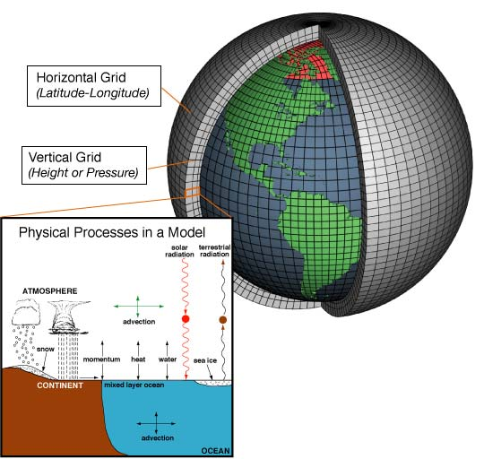
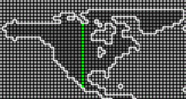

```{r, echo = FALSE, message = FALSE, warning=FALSE}
require(tidyverse)
require(kableExtra)
scenarios <- read.csv(file = "../_chapter_materials/scenarios.csv", header = T, sep = ",")
```


# Background information

Human industrial activity, use of fossil fuels, and land use changes have been leading to increased atmospheric concentrations of carbon dioxide and other greenhouse gases (GHGs). GHGs in the atmosphere allow electromagnetic radiation (light) to pass through to the Earth's surface, but absorb the infrared radiation (i.e. heat) that is emitted by the Earth out toward space. 

Because these processes are occurring at scales that are impossible to meaningfully study in a laboratory settings, scientists study the effects of GHG concentrations by constructing computer simulations (called Coupled Global Climate Models, or CGCMs Fig. 1) that mathematically represent the physical, chemical, and biological processes of the climate system. We have a decent understanding of how physical processes interact to form large-scale climate features, including how GHGs influence climate. To predict the effects of GHG emissions on climate, scientists plug predictions of GHG emissions into a CGCM to predict future climates under different emissions scenarios.

```{r model-fig, echo = FALSE, fig.cap="Coupled global climate models simulate physical processes in both the atmosphere and from landscape/oceanic features (NOAA, public domain). Each cell in the climate model contains these features, and energy and matter may pass from one cell to another (the cells are not isolated).", out.width="100%"}

```

```{r scenario-table, echo = FALSE}
knitr::kable(
  scenarios, booktabs = TRUE,
  caption = 'Characteristics of selected emissions scenarios from the Intergovernmental Panel on Climate Change. These scenarios represent alternative possibilities for future social and technological change as envisioned by a collaboration of governmental and non-governmental analysts.'
) %>%
column_spec(1, width = "20em")%>%
column_spec(2, width = "10em")%>%
column_spec(3, width = "10em")%>%
column_spec(4, width = "10em")%>%
kable_styling(latex_options = c("striped", "scale_down"))

```

The community of climate change experts has developed different storylines that describe alternative possible futures, which each has its own projection of predicted quantities of GHG emissions (Table 1). To predict the effects of GHG emissions on climate, scientists plug predictions of GHG emissions into a CGCM to predict future climate under different emissions scenarios. 


# Objectives

You will work with output from a simulation run from the 3rd-generation CGCM produced by the Canadian Center for Climate Modeling and Analysis. This dataset focuses on near-surface air temperature - the same type of temperature reported in the daily weather report. The temperature is reported in mean temperature ($^\circ$K) for each month during the 21^st^-century (2001-2100), giving a total of 1200 values for the 1200 consecutive months. You are provided these data for the three emissions scenarios described in Table 1 (A1B, A2, B1) and a fourth set of conditions representing "Committed" climate change. The "Committed" set of conditions assumes that the composition of the atmosphere remains unchanged at year 2001 values (which has already been proven entirely unrealistic). Therefore, the only climate changes that will occur are those to which the climate system is already committed due to changes in atmospheric concentration as of the year 2001. The Committed scenario is not intended as a realistic scenario. Instead, it serves as a pseudo control so that we can compare the other climate scenarios to a baseline. By comparing the results of a given scenario with the results under the Committed scenario, one can see how much additional climate change a scenario produces compared to what would be produced if alterations in climate forcing agents were arrested at 2001 levels.

Since climate is highly variable across the globe, you will focus on a particular grid cell in a continuous North-South transect through North America (Fig. 2) for questions 1 and 2. These grid cells will be assigned either in lab, or on Canvas. For question 3, you will use all of the data.

```{r transect-fig, echo = FALSE, fig.cap="Location of latitudinal transect through North America for which you have data. The amount of sunlight reaching the earth's surface varies greatly along the transect (as does other seasonal features such as precipitation, ice-sheet cover, etc)."}

```

\pagebreak

1. Will future near-surface air temperature be influenced by GHG emissions?
    * Seasonal variation in temperature will probably mask any long-term trends in temperature due solely to GHG concentrations. With that in mind, analyze data just using one month (July) in the dataset:
        + Make a graph [geom_point()] showing how temperature in **July** varies across the 100 years of the simulation for all of the emissions scenarios. 
2. Under the most extreme GHG emissions scenario (A2), will climate change have a greater effect in the winter or summer on near-surface temperatures?
    * Seasonal swings in irradiance is one of the primary natural control-knobs on temperature, so GHG emissions may cause temperature to change more in a particular season.
        + Repeat the prior analysis, but compare data from January and July (but only for the **A2 scenario**).
3. Under the most extreme GHG emissions scenario (A2), will climate change have a greater effect at high or low latitudes?
    * Irradiance is distributed unevenly across the globe, so the effect of GHG concentrations may differ based on location.
        + Create a graph examining 100-year mean temperature change (y-axis values) across latitude (x-axis values), which will help you address this question. 
    
    
Please provide statistical details when necessary (refer to your R analysis file).

\pagebreak

# Lab report specifics

1. Introduction
    * How do GHGs influence climate?
    * How do scientists study future climates?
    * Objectives
    * Hypotheses
2. Methods
    * Model particulars and analysis steps
    * Calculations / statistics
3. Results
    * Question 1 (text **AND** graph)
    * Question 2 (text **AND** graph)
    * Question 3 (text **AND** graph)
4. Discussion
    * Hypotheses rejected/supported
    * Provide a coherent explanation/interpretation of your results