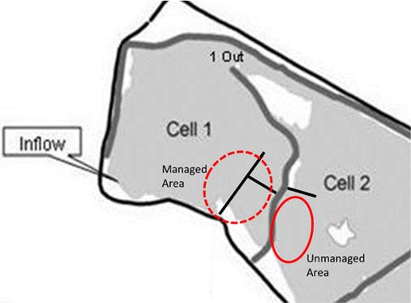

# Biodiversity & ecosystem management


## Background information

Community ecology depends directly on our ability to quantify the various species that compose the community or a component of the community (such as the plants present). Quantification of community composition is essential for understanding changes through time or impacts of management actions. This week we will quantify the community composition of wetland plants at the Lake Waco Wetlands (LWWs).

The LWWs has historically been strongly dominated by *Typha* (cattail). Although native to Texas, cattails are very agressive and frequently dominant wetlands to the exclusion of other species. To counter this dominance tendency, managers have tried to increase the diversity of the plant community in some areas of the LWWs by planting other species [especially *Schenoplectus* (bulrush) and *Pontederia* (pickerelweed)], or by hand-harvesting cattail out of some areas in the hopes that other species will colonize the open areas (Fig. \@ref(fig:restoration-fig)). 

```{r restoration-fig, echo = FALSE, fig.cap="Map showing cells 1 and 2 of the Lake Waco Wetlands (LWWs). The boardwalk in cell 1 has had frequent management for several years (dotted red circle), while cell 2 has had no mmanagement (solid red circle)."}

```

## Objectives

You will collect vegetation data from two zones in the LWWs which have different management histories. One area in Cell 1 adjacent to the floating boardwalk is a high visitation area where frequent management has taken place. In contrast, Cell 2 has had virtually no management. Five transects will be made originating from the boardwalk (cell 1) and from the levee (cell 2). Data about community composition will be recorded from 5 quadrats (area of 1 m^2^) along each transect. 

\pagebreak
Using the data generated and appropriate statistical analyses (contingency table or t-test), address the following questions:

1. Is management activity influencing the **abundance** of cattail?
    * A 2x2 contingency table is appropriate for this question.

2. Is management activity influencing the **dominance** of cattail?
    * A 2x2 contingency table is appropriate for this question.
    
3. Is management activity influencing **species richness**?
    * Could be addressed using a 2x2 contingency table or a t-test.
    
4. Does cattail dominance influence **species richness**?
    * Could be addressed using a 2x2 contingency table or a t-test. For this question, the grouping variable is *cattail dominance*, so you should use data from both cells!
    
\pagebreak

## Lab report specifics

1. Introduction
    * Why is biodiversity important?
    * Why sample vegetation?
    * Objectives
    * Hypotheses
2. Methods
    * Experimental design
    * Review how data was collected
    * Calculations / statistics
3. Results
    * Question 1 (text **AND** graph/table)
    * Question 2 (text **AND** graph/table)
    * Question 3 (text **AND** graph/table)
    * Question 4 (text **AND** graph/table)
4. Discussion
    * Hypotheses rejected/supported
    * Provide a coherent explanation/interpretation of your results
