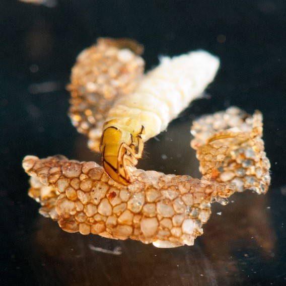

---
output:
  pdf_document: default
  html_document: default
---
# Nutrient limitation


## Background information

All organisms need nutrients to grow and reproduce. For primary producers, nitrogen (N) and phosphorus (P) are two macronutrients that frequently limit growth (or are in . The primary source of inorganic P is from P-bearing rock, or from the remineralization of P from organic sources (i.e. the decomposition of dead biomass). N, on the other hand, composes nearly 78% of the atmosphere, but this inorganic N-pool is largely inaccessible to most organisms. Some organisms are able to fix N (N-fixing organisms) and access this gaseous pool, which gives them a competitive advantage when N is low in the environment. 

The 

Benthic macroinvertebrates (Fig. \@ref(fig:invert-fig)) are a useful group of study organisms because they are incredibly diverse, and are important ecological indicators of the physical and chemical characteristics of their ecosystem. Some are incredibly sensitive to changes in dissolved oxygen or pH, or will struggle if sediment loads into the stream from the surrounding landscape is too high. Stream ecosystems are linked to the areas around them (their watershed). Think of some ways that humans influence the landscape - then Google how those changes influence aquatic environments (most anthropogenic impacts are very well studied). 


```{r partition-fig, echo = FALSE, fig.cap="Schematic representation of how alpha (sample level), gamma (region level), and beta (sample variability) diversities are related. For each stream you have multiple measures of alpha-diversity (taxa richness), with one measure of gamma and beta-diversity per stream."}
knitr::include_graphics("chapter_materials/biodiversity_ecology/partitioning.jpg")
```

```{r invert-fig, echo = FALSE, fig.cap="Example macroinvertebrate (Order: Trichoptera) that you will collect in the field and identify under a dissecting microscope. Caddisflies frequently have elaborate shells built from materials around them in the stream."}

```

## Objectives

We collected macroinvertebrates from 2 sites in central Texas that differed in anthropogenic impact using 1 m^2^ kick-screens. Neils Creek is a relatively unimpacted site, with some pasture, farmland, and forrest in its watershed, while Harris Creek is surrounded by heavy farming activity and neighborhoods. Actually, the Fall 2017 class collected the Harris Creek data for you, but you get the idea. You will use this data to answer the following questions:

1. Does anthropogenic impact influence biodiversity?
    * Assess this question by calculating alpha, gamma, and beta-diversity for the 2 sites.

2. Does anthropogenic impact influence the EPT taxa in a stream?
    * Assess this question by calculating the %EPT in each sample. 
    

## Lab report specifics

1. Introduction
    * Why is biodiversity important?
    * How is biodiversity measured?
    * Why are macroinvertebrates useful?
    * Objectives
    * Hypotheses
2. Methods
    * Experimental design and field work
    * laboratory work
    * Calculations / statistics
3. Results
    * Question 1 (text **AND** graph)
    * Question 2 (text **AND** graph)
4. Discussion
    * Hypotheses rejected/supported
    * Provide a coherent explanation/interpretation of your results
