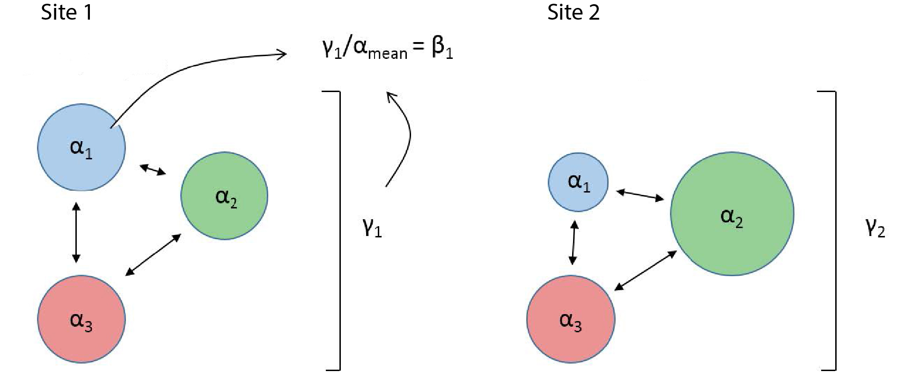
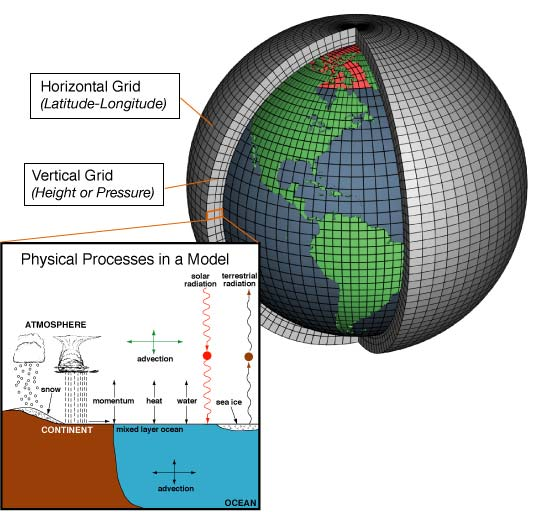

--- 
title: "Biology 3103 - Ecology Laboratory"
author: "S Cook"
date: "Summer 2018"
bibliography: [book.bib, packages.bib]
biblio-style: apalike
link-citations: yes
colorlinks: yes
lot: yes
lof: yes
site: bookdown::bookdown_site
description: "Ecology labs for Baylor University"
graphics: yes
fontfamily: mathpazo
#cover-image: images/cover.jpg
---

```{r setup, include=FALSE}
options(
  htmltools.dir.version = FALSE, formatR.indent = 2, width = 55, digits = 4
)

# install the packages needed by this book; you fill out c(), e.g. c('ggplot2', 'dplyr')
lapply(c(), function(pkg) {
  if (system.file(package = pkg) == '') install.packages(pkg)
})
```

# Preface {-}

Filler.

## Why read this book {-}

More filler.

## Structure of the book {-}

Chapters \@ref(introduction) introduces a new topic, and ...

## Software information and conventions {-}

I used the **knitr**\index{knitr} package [@xie2015] and the **bookdown**\index{bookdown} package [@R-bookdown] to compile my book. My R session information is shown below:

```{r}
sessionInfo()
```

Package names are in bold text (e.g., **rmarkdown**), and inline code and filenames are formatted in a typewriter font (e.g., `knitr::knit('foo.Rmd')`). Function names are followed by parentheses (e.g., `bookdown::render_book()`).

## Acknowledgments {-}

There are lots.


<!--chapter:end:index.Rmd-->

\mainmatter

# Population Ecology {#population}

## Background information

Organisms have evolved different life history strategies which differ in their methods of reproduction, care of offspring, timing of growth, means of resource acquisition, and prey avoidance. While these factors and how they interact can be highly complex, **survivorship** offers a simple means to quantify how a particular population ensures their reproductive success. For example, humans devote an enormous amount of energy and resources to offspring care, which results in low mortality rates among their young. On the other hand, most insects produce a massive number of offspring that have extremely high rates of mortality.

Plotting the number of survivors against age yields what is called a 'survivorship-curve' (Fig. \@ref(fig:survivor-fig)), which is a visual way to assess how various organisms differ in their **life-history strategies** (number of offspring, number of reproductive cycles, degree of parental care, etc.). Scientists can use these plots to examine differences in organisms, or assess changes within subsets of a population.

```{r survivor-fig, echo = FALSE, fig.cap="Idealized examples of Types I, II, and III survivorship curves overlaid with example organisms. Type I survivorship is characterized by high probability of survival early in life, followed by a rapid decline as individuals reach older age. Type II survivorship displays roughly constant mortality throughout the lifespan of the organism, and Type III exhibits high mortality among young offspring."}
knitr::include_graphics("chapter_materials/population_ecology/base_plot.pdf")
```

## Objectives

You will use the cemetery data, as well as data generated by the U.S. Fish & Wildlife Service [@milsap_bald_2016], to address hypotheses about different populations. We can use birth and death years on gravestones, as well as names (to infer gender), to collect simple but useful information to collect demographic data for the local human population. The survivorship curve you will generate from this data will inform some ideas about the life history strategy of humans.

```{r eagle-fig, echo = FALSE, fig.cap="Migratory Golden eagle in Denali National Park and Preserve. Mating pairs return each year to northern nesting territory in the spring, and most new fledglings leave the nest by mid-August. During winter their range extends from southern Canada to south of the Rocky Mountains[@brown_patterns_2017]."}
knitr::include_graphics("chapter_materials/population_ecology/golden_eagle.jpg", dpi = NA)
```

Additionally, survey data collected by state and federal agencies provide valuable information about natural population. We can use ancillary data about individuals within a population to examine how different forces influence demographics within a population. Golden Eagles are federally protected in the United States, and Fish & Wildlife collects detailed information from tagged individuals (Fig. \@ref(fig:eagle-fig)).

We will use this data to test hypotheses addressing the following questions:

1. Do humans and eagles display different life history strategies?
2. Does gender affect survivorship in human populations?
    * And if so, how?
3. Does human impact affect survivorship in eagle populations?
    * And if so, how?
  
Please form testable null hypotheses to address question number 1 and **either** question 2 or 3 (pick one). If you want, you may also substitute question 2 or 3 to address a hypothesis using the extra data we generated from the gravestones (height of gravestones as a proxy of material wealth). 

To evaluate your hypotheses, you will...

1. Statistically address differences in survivorship between groups using a **t-test**, and display that information using a **bar-graph**
2. Unpack question 1 by **computing** and **displaying survivorship** (no statistical test needed for this part).

\pagebreak

## Lab Report Specifics

Below are some specific guidelines for this lab report, but you should also utilize the general grading rubric in the Syllabus!

* **Participation** (1 pts)

* **Introduction** (2 pts)
    * General information about population ecology / life history strategies
    * How are survivorship curves used in population ecology?
    * Build up rationale to lead into your objectives/hypotheses statements.
    
* **Methods** (2 pts)
    * Explanation of data collection and analysis
    
* **Results** (5 pts)
    * Summary statistics in the text
    * Bar-plots and associated t-tests for each question
    * Survivorship curves for each question
    
* **Discussion** (2 pts)
    * Explain your results in light of your hypotheses
    * What are some plausible explanations for differences (or lack thereof) between groups?
    * Place your results in an evolutionary context.

<!--chapter:end:01-population-eco.Rmd-->

---
output:
  pdf_document: default
  html_document: default
---
# Physiological Ecology


## Background information
\newcommand{\textunderscript}[1]{$_{\text{#1}}$}
In the presence of light, photosynthetic organisms can utilize light and carbon dioxide (CO~2~) to make sugars - the process of photosynthesis. The sugars made are used by these organisms (and organisms that eat them) as a source of energy. A by-product of the photosynthetic process is the liberation of oxygen (O~2~).

Alongside photosynthesis, these organisms are consuming oxygen via respiration. Although respiration and photosynthesis both take place in the light, in the dark only respiration occurs (since photosynthesis is a light-dependent process). Though it is impossible to directly measure gross photosynthesis (or the total amount of O~2~ produced [@wohlfahrt_many_2015], we *can* measure respiration (R) as the **rate of O~2~ consumed** in the dark, and the **rate of oxygen produced** in the presence of light as a measure of net photosynthesis (P~net~). Combining these direct measurements, we can estimate gross photosynthesis (P~gross~).

\begin{equation}
\color{blue} P_{net} \color{black}= \color{red}P_{gross} \color{black}- \color{blue}R
(\#eq:photosynthesis)
\end{equation}

Using equation \@ref(eq:photosynthesis), we can use the direclty measured terms in \color{blue} blue \color{black}, and may use them to calculate \color{red} P~gross~ \color{black}.

Organisms capable of photosynthesis span an incredible range of phylogeny, from *unicellular algae* to *vascular plants* (Fig. \@ref(fig:organisms)). While every algae cell is photosynthetic, *aquatic macrophytes* (i.e. vascular plants adapted to live in aquatic ecosystems) have large amounts of specialized tissue devoted to the transportation of resources and structural support. These two organisms are in competition for very similar resources (such as sunlight and dissolved nutrients) - how do their morphological adaptations convey a competitive advantage?

```{r organisms, fig.ncol = 2, echo = FALSE, fig.cap = "Aquatic algae (left pane, in both meta- and periphyton communities) and aquatic macrophytes (right pane) are photosynthetic organisms that evolved in aquatic ecosystems.", fig.show='hold', out.width="50%"}
knitr::include_graphics(c("chapter_materials/physiological_ecology/aquatic_photosynthesis.jpg",
                          "chapter_materials/physiological_ecology/ludwigia.jpg"), dpi = NA)
```

## Objectives

You will form hypotheses to test questions about photosynthesis in 2 aquatic organisms - algae and a common aquatic macrophyte.

1. Which organism has the highest rate of *biomass specific* gross photosynthesis?

2. Which organism has the highest rate of *biomass-specific* respiration?

3. Which organism has the highest rate of net primary production (NPP) per day?

## Materials & methods

You will be using a common **oxygen-change method** to determine rates of photosynthesis and respiration. Biological oxygen demand (BOD) bottles use a stopper that prevents gas exchange, which provides a means of isolating processes happening inside the bottle from the outside environment. 

\pagebreak

### Materials

\begin{multicols}{2}
\begin{itemize}{}
  \item 10 L photosynthesis solution\footnote{10 L DI Water, 917 mg CaCl\textunderscript{2}, 960 mg MgSO\textunderscript{4}, 584 mg NaHCO\textunderscript{3}, 154 mg KHCO\textunderscript{3}}\\(40\% air saturation\footnote{Aerate with N\textunderscript{2} gas for 10 minutes})
  \item Samples of algae and macrophytes
  \item 330 mL BOD bottles
  \item Dissolved O\textsubscript{2} meter (DO Meter)
  \item Light source (> 400 \textmu E m\textsuperscript{-2}s\textsuperscript{-1})
  \item Aluminum foil
  \item Stir bars / stir plate
  \item Sieves (fine mesh)
  \item Forceps
  \item Drying boats (aluminum)
  \item Analytical balance \\(capable of 0.001 g)
  \item Drying oven
\end{itemize}
\end{multicols}

Oxygen production varies with the intensity of light, but reaches saturation as light intensity increases (Fig. \@ref(fig:light-response-fig)). Since different organisms display different light-response curves, we need to saturate their photosystems with high light levels to account for a potential confounding variable in our experiment.

```{r light-response-fig, echo = FALSE, fig.cap="A photosynthesis light-response curve illustrates that as light intensity increases, dissolved oxygen (DO) production eventually becomes saturated. In the dark, photosynthesis shuts off, and respiration causes the rate of DO production to fall below 0 (red circle on the y-axis)."}
knitr::include_graphics("chapter_materials/physiological_ecology/light_response_curve.pdf")
```

### Methods

1. Each group will be responsible for **one** of the two species. Fill 9 BOD bottles with photosynthesis solution (fill to brim - the idea with BOD bottles is for the glass stopper to push any excess water out of the seal the stopper creates). 
2. Carefully transfer a representative sample of your organism into 8 of the BOD bottles. Add a small stir bar to each bottle, and place the glass stopper and plastic cap on the bottle to seal. Use the DO probe to measure oxygen concentration in the remaining bottle (your control bottle).
3. You will have 4 replicates for the dark treatment, and 4 for the light. Wrap the dark treatment bottles in aluminum foil, and place the light treatment bottles under the light source. \underline{Record the intial times for these samples}.
4. While you wait (at least 1.5 hours)...
    * Observe samples of these organisms under a dissecting/compound microscope and note differences in morphology. Note differences in the proportion of support tissues (i.e. stems) vs. photosynthetic tissues for each organism.
5. After at least 1.5 hours, measure DO concentrations in the light bottles. Make sure to record the end time each time you take a DO measurement.
6. After 2 hours, measure the DO concentrations in the dark bottles. Make sure to record the end time each time you take a DO measurement.
7. Carefully empty the BOD bottle into a fine-mesh sieve to separate the sample from the photosynthesis solution. Collect/scrape the sample into a labeled aluminum drying tin, and place tins into a drying oven for 24 hrs at 105\textdegree{}C.

## Data analysis

You can directly determine P~net~ (from the light treatment bottles) and R (from the dark treatment bottles) by calculating the change (\textDelta) in dissolved oxygen (DO) concentrations:

\begin{equation}
\Delta{}DO = DO_{final} - DO_{initial}
(\#eq:delta)
\end{equation}

You also recorded the elapsed incubation time(\textDelta{}h), the volume of the BOD bottles (0.330 L), and the mass of the sample (in dry weight, g). Using equation \@ref(eq:photosynthesis), after getting \textDelta{}DO normalized to volume (L) and dry weight (g), you can then calculate P~gross~, or the total oxygen produced by photosynthesis per unit biomass.

For the 1\textsuperscript{st}, and 2\textsuperscript{nd} questions, a two-sample t-test comparing the rates of each process (P~gross~ and R) will tell you if there are significant differences between each organism. Bar-graphs (with error-bars display the stardard error of the mean) are a good way of displaying this data visually. 

The 3\textsuperscript{rd} question requires you to construct a simple **model**. A model is a way to represent a natural process using mathematics. Some models are simple (like the one you will construct), and some are incredibly complex. What assumptions can you make to tackle question 3? If we assume that these organisms respire for 24 hours a day, and only photosynthesize when the sun is out (10 hours a day), we can use these values as a foundation for our model (Fig. \@ref(fig:photo-model)). While this makes the maths significantly easier, what are the limitations of this assumption?

```{r photo-model, echo = FALSE, fig.cap="A photosynthesis light-response curve illustrates that as light intensity increases, dissolved oxygen (DO) production eventually becomes saturated. In the dark, photosynthesis shuts off, and respiration causes the rate of DO production to fall below 0 (red circle on the y-axis)."}
knitr::include_graphics("chapter_materials/physiological_ecology/photo_model.pdf")
```

There are no associated statistical tests for question 3, since you should calculate daily values using mean P~gross~ and mean R (no replicate values for this question). You can present the results of your model in the text of your results section. 

\pagebreak

## Lab report specifics
1. Introduction
    * Importance of photosynthesis
    * Morphological adaptations of aquatic photosynthesizers
    * Objectives
    * Hypotheses
2. Methods
    * Oxygen change method (light/dark treatments)
    * Experimental design
    * Calculations / statistics / model explanation
3. Results
    * Results/graphs/statistics for questions 1 and 2
    * Results for question 3
4. Discussion
    * Hypotheses rejected/supported?
    * Provide a coherent explanation for the patterns you see in the photosynthesis and respiration data (use your observations of morphology and the information you covered in your introduction to tie everything together)

```{r, echo =FALSE, message = FALSE, fig.cap="Data table for recording dissolved oxygen measurements."}
require(tidyverse)
require(kableExtra)
data_sheet <- read.csv(file = "chapter_materials/physiological_ecology/data_sheet.csv", 
                         header = T, 
                         sep = ",")

data_sheet[is.na(data_sheet)] <- " "

col_headings <- c("BOD No.", "Organism", "Treatment", "Initial time", "Initial DO (mg/L)", "Final time", "Final DO (mg/L)", "Dish ID", "Weight (g)")

names(data_sheet) <- col_headings

knitr::kable(data_sheet,
             booktabs = T,
             "latex",
             linesep = "") %>%
  kable_styling(latex_options = c("striped", "scale_down"),
                font_size = 8) %>%
  landscape() %>%
  column_spec(c(1,4,5,6,7,8,9), width="1cm")
```

```{r, echo =FALSE, message = FALSE, fig.cap="Calculations table."}

col_headings <- c("BOD No.", "Organism", "Treatment", "Elapsed time (h)", "Delta DO (mg/L)", "Delta DO (mg)", "Net Rate O2 (mg/(g*h))", "Rate (mg/(g*h))", "Daily")

names(data_sheet) <- col_headings

knitr::kable(data_sheet,
             booktabs = T,
             "latex",
             linesep = "") %>%
  kable_styling(latex_options = c("striped", "scale_down"),
                font_size = 8) %>%
  landscape() %>%
  column_spec(c(1,4,5,6,7,8,9), width="1cm")
```

<!--chapter:end:02-physiological-eco.Rmd-->

# Biodiversity & ecosystem management


## Background information

Community ecology depends on our ability to quantify the various species that compose the community in an area or a subset of the community (such as the plants present). Quantification of community composition is essential for understanding changes through time or impacts of management actions. This week we will describe management effects on the plant community at the Lake Waco Wetlands (LWWs).

The LWWs has historically been strongly dominated by *Typha* (cattail). Although native to Texas, cattails are very agressive and frequently dominant wetlands to the exclusion of other species. To counter this dominance tendency, managers have tried to increase the diversity of the plant community in some areas of the LWWs by planting other species [especially *Schenoplectus* (bulrush) and *Pontederia* (pickerelweed)], or by hand-harvesting cattail out of some areas in the hopes that other species will colonize the open areas (Fig. \@ref(fig:restoration-fig)). 

```{r restoration-fig, echo = FALSE, fig.cap="Map showing cells 1 and 2 of the Lake Waco Wetlands (LWWs). The boardwalk in cell 1 has been managed for several years (dotted red circle), while cell 2 has had no management (solid red circle)."}
knitr::include_graphics("chapter_materials/restoration_ecology/lww_management.jpg")
```

## Objectives

You will collect vegetation data from two zones in the LWWs which have different management histories. One area in Cell 1 adjacent to the floating boardwalk is a high visitation area where frequent management has taken place. In contrast, Cell 2 has had virtually no management. Five transects will be made originating from the boardwalk (cell 1) and from the levee (cell 2). Data about community composition will be recorded from 5 quadrats (area of 1 m^2^) along each transect. 

\pagebreak
Using the data generated and appropriate statistical analyses (contingency table or t-test), address the following questions:

1. Is management activity influencing the **abundance** of cattail?
    * A 2x2 contingency table is appropriate for this question.

2. Is management activity influencing the **dominance** of cattail?
    * A 2x2 contingency table is appropriate for this question.
    
3. Is management activity influencing **species richness**?
    * Could be addressed using a 2x2 contingency table or a t-test.
    
4. Does cattail dominance influence **species richness**?
    * Could be addressed using a 2x2 contingency table or a t-test. For this question, the grouping variable is *cattail dominance*, so you should use data from both cells!
    
\pagebreak

## Lab report specifics

1. Introduction
    * Why is biodiversity important?
    * Why sample vegetation?
    * Objectives
    * Hypotheses
2. Methods
    * Experimental design
    * Review how data was collected
    * Calculations / statistics
3. Results
    * Question 1 (text **AND** graph/table)
    * Question 2 (text **AND** graph/table)
    * Question 3 (text **AND** graph/table)
    * Question 4 (text **AND** graph/table)
4. Discussion
    * Hypotheses rejected/supported
    * Provide a coherent explanation/interpretation of your results

<!--chapter:end:03-restoration-eco.Rmd-->

---
output:
  pdf_document: default
  html_document: default
---
# Biodiversity: measuring biological integrity


## Background information

Quantifying biodiversity is an active area of research for ecologists and conservationists. Organisms have evolved alongside each other, and developed adaptations that allow them to thrive in different niches. The interactions between these organisms, and between these organisms and their environment can be incredibly complex. How diverse communities are, and how diversity changes area to area, can tell us a lot about a system. How do we even measure diversity? Or how similar 2 areas are? Alpha-diversity is a measure of biodiversity at a single location, while gamma-diversity is the cumulative diversity in a particular region of interest. Beta-diversity links the two, and is a measure of variable the subsets of gamma-diversity are (Fig. \@ref(fig:partition-fig)). 

Scientists have been arguing for years about the best way to measure biodiversity, but at its heart all biodiversity metrics are a way to compress complex information into an interpretable number. A coarse analogy would be the Body Mass Index (BMI) score. Humans are comprised of assemblages of cells and organ systems, and we could measure the health of a single individual in thousands of different ways. The BMI score is a simple way to compress that information into a single number that we can use to assess relative 'health'. We can do something similar for biodiversity! I do not want you to conflate 'health' with 'biodiversity', but it is a useful starting point.

Benthic macroinvertebrates (Fig. \@ref(fig:invert-fig)) are a useful group of study organisms because they are incredibly diverse, and are important ecological indicators of the physical and chemical characteristics of their ecosystem. Some are incredibly sensitive to changes in dissolved oxygen or pH, or will struggle if sediment loads into the stream from the surrounding landscape is too high. Stream ecosystems are linked to the areas around them (their watershed). Think of some ways that humans influence the landscape - then Google how those changes influence aquatic environments (most anthropogenic impacts are very well studied). 


```{r partition-fig, echo = FALSE, fig.cap="Schematic representation of how alpha (sample level), gamma (region level), and beta (sample variability) diversities are related. For each stream you have multiple measures of alpha-diversity (taxa richness), with one measure of gamma and beta-diversity per stream."}

```

```{r invert-fig, echo = FALSE, fig.cap="Example macroinvertebrate (Order: Trichoptera) that you will collect in the field and identify under a dissecting microscope. Caddisflies frequently have elaborate shells built from materials around them in the stream."}
knitr::include_graphics("chapter_materials/biodiversity_ecology/invert_pic.jpg")
```

## Objectives

We collected macroinvertebrates from 2 sites in central Texas that differed in anthropogenic impact using 1 m^2^ kick-screens. Neils Creek is a relatively unimpacted site, with some pasture, farmland, and forrest in its watershed, while Harris Creek is surrounded by heavy farming activity and neighborhoods. Actually, the Fall 2017 class collected the Harris Creek data for you, but you get the idea. You will use this data to answer the following questions:

1. Does anthropogenic impact influence biodiversity?
    * Assess this question by calculating alpha, gamma, and beta-diversity for the 2 sites.

2. Does anthropogenic impact influence the EPT taxa in a stream?
    * Assess this question by calculating the %EPT in each sample. 
    

## Lab report specifics

1. Introduction
    * Why is biodiversity important?
    * How is biodiversity measured?
    * Why are macroinvertebrates useful?
    * Objectives
    * Hypotheses
2. Methods
    * Experimental design and field work
    * laboratory work
    * Calculations / statistics
3. Results
    * Question 1 (text **AND** graph)
    * Question 2 (text **AND** graph)
4. Discussion
    * Hypotheses rejected/supported
    * Provide a coherent explanation/interpretation of your results

<!--chapter:end:04-biodiversity-eco.Rmd-->

---
output:
  pdf_document: default
  html_document: default
---
# Nutrient limitation


## Background information

All organisms need nutrients to grow and reproduce. For primary producers, nitrogen (N) and phosphorus (P) are two macronutrients that frequently limit growth (or are in . The primary source of inorganic P is from P-bearing rock, or from the remineralization of P from organic sources (i.e. the decomposition of dead biomass). N, on the other hand, composes nearly 78% of the atmosphere, but this inorganic N-pool is largely inaccessible to most organisms. Some organisms are able to fix N (N-fixing organisms) and access this gaseous pool, which gives them a competitive advantage when N is low in the environment. 


## Objectives

We collected macroinvertebrates from 2 sites in central Texas that differed in anthropogenic impact using 1 m^2^ kick-screens. Neils Creek is a relatively unimpacted site, with some pasture, farmland, and forrest in its watershed, while Harris Creek is surrounded by heavy farming activity and neighborhoods. Actually, the Fall 2017 class collected the Harris Creek data for you, but you get the idea. You will use this data to answer the following questions:

1. Does anthropogenic impact influence biodiversity?
    * Assess this question by calculating alpha, gamma, and beta-diversity for the 2 sites.

2. Does anthropogenic impact influence the EPT taxa in a stream?
    * Assess this question by calculating the %EPT in each sample. 
    

## Lab report specifics

1. Introduction
    * Why is biodiversity important?
    * How is biodiversity measured?
    * Why are macroinvertebrates useful?
    * Objectives
    * Hypotheses
2. Methods
    * Experimental design and field work
    * laboratory work
    * Calculations / statistics
3. Results
    * Question 1 (text **AND** graph)
    * Question 2 (text **AND** graph)
4. Discussion
    * Hypotheses rejected/supported
    * Provide a coherent explanation/interpretation of your results

<!--chapter:end:05-algalbioassay_eco.Rmd-->

---
output:
  pdf_document: default
  html_document: default
---

```{r, echo = FALSE, message = FALSE, warning=FALSE}
scenarios <- read.csv(file = "chapter_materials/climate_ecology/scenarios.csv", header = T, sep = ",")
```

# Climate modeling


## Background information

Human industrial activity, use of fossil fuels, and land use changes have been leading to increased emissions and atmospheric concentrations of carbon dioxide and other greenhouse gases (GHGs). GHGs in the atmosphere allow electromagnetic radiation (light) to pass through to the Earth's surface, but absorb the radiation that is emitted by the Earth out toward space. 

Scientists study the effects of GHG concentrations by constructing computer simulations (called Coupled Global Climate Models, or CGCMs Fig. \@ref(fig:model-fig)) that mathematically represent the physical, chemical, and biological processes of the climate system. We have a descent understanding of how these processes interact to form large-scale climate features, including how GHGs influence climate. To predict the effects of GHG emissions on climate, scientists plug predictions of GHG emissions into a CGCM to predict future climates under different emissions scenarios.

```{r model-fig, echo = FALSE, fig.cap="Coupled global climate models simulate physical processes in both the atmosphere and from landscape/oceanic features (NOAA, public domain). Each cell in the climate model contains these features, and energy and matter may pass from one cell to another (the cells are not isolated)."}

```

The community of climate change experts has developed different storylines that describe alternative possible futures, which each has its own projection of predicted quantities of GHG emissions (Table \@ref(tab:scenario-table)). To predict the effects of GHG emissions on climate, scientists plug predictions of GHG emissions into a CGCM to predict future climate under different emissions scenarios. 

```{r scenario-table, echo = FALSE}
knitr::kable(
  scenarios, booktabs = TRUE,
  caption = 'Characteristics of selected emissions scenarios from the Intergovernmental Panel on Climate Change. These scenarios represent alternative possibilities for future social and technological change as envisioned by a collaboration of governmental and non-governmental analysts.'
) %>%
column_spec(1, width = "20em")%>%
column_spec(2, width = "10em")%>%
column_spec(3, width = "10em")%>%
column_spec(4, width = "10em")%>%
kable_styling(latex_options = c("striped", "scale_down"))

```


## Objectives

You will work with output from a simulation run from the 3rd-generation CGCM produced by the Canadian Center for Climate Modeling and Analysis. This dataset focuses on near-surface air temperature - the same type of temperature reported in the daily weather report. The temperature is reported in mean temperature ($^\circ$K) for each month during the 21^st^-century (2001-2100), giving a total of 1200 values for the 1200 concecutive months. You are provided these data for the three emissions scenarios described in Table \@ref(tab:scenario-table) (A1B, A2, B1) and a fourth set of conditions representing "Committed" climate change. The "Committed" set of conditions assumes that the composition of the atmosphere remains unchanged at year 2001 values (which has already been proven entirely unrealistic). Therefore, the only climate changes that will occur are those to which the climate system is already committed due to changes in atmospheric concentration as of the year 2001. The Committed scenario is not intended as a realistic scenario. Instead, it serves as a control for comparison with the other scenarios. By comparing the results of a given scenario with the results under the Committed scenario, one can see how much additional climate change a scenario produces compared to what would be produced if alterations in climate forcing agents were arrested at 2001 levels.

Since climate is highly variable across the globe, you will focus on a particular grid cell in a continuous North-South trasect through North America (Fig. \@ref(fig:transect-fig)) for questions 1 and 2. These grid cells will be assigned either in lab, or on Canvas. For question 3, you will use all of the data.

```{r transect-fig, echo = FALSE, fig.cap="Location of latitudinal transect through North America for which you have data. The amount of sunlight reaching the earth's surface varies greatly along the transect (as does other seasonal features such as precipitation, ice-sheet cover, etc)."}

```

1. Will future near-surface air temperature be influenced by GHG emissions?
    * Seasonal variation in temperature will probably mask any long-term trends in temperature due solely to GHG concentrations. With that in mind, analyze data just using one month (July) in the dataset:
        + Make a graph [geom_point()] showing how temperature in **July** varies across the 100 years of the simulation for all of the emissions scenarios. 
2. Under the most extreme GHG emissions scenario (A2), will climate change have a greater effect in the winter or summer on near-surface temperatures?
    * Seasonal swings in irradiance is one of the primary natural control-knobs on temperature, so GHG emissions may cause temperature to change more in a particular season.
        + Repeat the prior analysis, but compare data from January and July (but only for the **A2 scenario**).
3. Under the most extreme GHG emissions scenario (A2), will climate change have a greater effect at high or low latitudes?
    * Irradiance is distributed unevenly across the globe, so the effect of GHG concentrations may differ based on location.
        + Create a graph examining 100-year mean temperature change (y-axis values) across latitude (x-axis values), which will help you address this question. 
    

## Lab report specifics

1. Introduction
    * How do GHGs influence climate?
    * How do scientists study future climates?
    * Objectives
    * Hypotheses
2. Methods
    * Model particulars and analysis steps
    * Calculations / statistics
3. Results
    * Question 1 (text **AND** graph)
    * Question 2 (text **AND** graph)
    * Question 3 (text **AND** graph)
4. Discussion
    * Hypotheses rejected/supported
    * Provide a coherent explanation/interpretation of your results

<!--chapter:end:05-climate-eco.Rmd-->

`r if (knitr:::is_html_output()) '# References {-}'`

```{r include=FALSE}
# generate a BibTeX database automatically for some R packages
knitr::write_bib(c(
  .packages(), 'bookdown', 'knitr', 'rmarkdown'
), 'packages.bib')
```


<!--chapter:end:08-references.Rmd-->

